# 📊 Diagramas del Proyecto PRISMA - Sistema de Reclutamiento

## Índice
1. [Diagrama de Arquitectura de Microservicios](#1-diagrama-de-arquitectura-de-microservicios)
2. [Diagrama de Base de Datos (ER)](#2-diagrama-de-base-de-datos-er)
3. [Diagrama de Casos de Uso](#3-diagrama-de-casos-de-uso)
4. [Diagramas de Secuencia](#4-diagramas-de-secuencia)
5. [Diagrama de Componentes - Clean Architecture](#5-diagrama-de-componentes---clean-architecture)
6. [Diagrama de Despliegue](#6-diagrama-de-despliegue)
7. [Diagrama de Clases del Dominio](#7-diagrama-de-clases-del-dominio)

---

## 1. Diagrama de Arquitectura de Microservicios

```mermaid
graph TB
    subgraph "Frontend Layer"
        FE[React + TypeScript Frontend<br/>Port: 5173/80]
    end

    subgraph "API Gateway / Load Balancer"
        NGINX[Nginx Reverse Proxy<br/>Port: 80/443]
    end

    subgraph "Microservices Layer"
        AUTH[Auth Service<br/>Node.js + TypeScript<br/>Port: 3001]
        REC[Recruitment Service<br/>PHP + Slim<br/>Port: 3002]
        DOC[Document Service<br/>Python + FastAPI<br/>Port: 3003]
    end

    subgraph "Database Layer"
        DB1[(Auth DB<br/>PostgreSQL<br/>Port: 5434)]
        DB2[(Recruitment DB<br/>PostgreSQL<br/>Port: 5433)]
        DB3[(Document DB<br/>PostgreSQL<br/>Port: 5435)]
    end

    subgraph "Storage Layer"
        S3[Local Storage/<br/>AWS S3]
    end

    subgraph "External Services"
        SES[AWS SES<br/>Email Service]
        SQS[AWS SQS<br/>Queue Service]
    end

    FE -->|HTTP/HTTPS| NGINX
    NGINX --> AUTH
    NGINX --> REC
    NGINX --> DOC
    
    AUTH -->|JWT Validation| REC
    AUTH -->|JWT Validation| DOC
    REC -->|Document Upload| DOC
    
    AUTH --> DB1
    REC --> DB2
    DOC --> DB3
    
    DOC --> S3
    REC --> SES
    REC --> SQS
    
    style FE fill:#61dafb,stroke:#333,stroke-width:2px,color:#000
    style AUTH fill:#68a063,stroke:#333,stroke-width:2px,color:#fff
    style REC fill:#8892be,stroke:#333,stroke-width:2px,color:#fff
    style DOC fill:#009688,stroke:#333,stroke-width:2px,color:#fff
```

**Descripción:**
- **Frontend**: Aplicación React que consume las APIs de los microservicios
- **Auth Service**: Gestiona autenticación, autorización y usuarios
- **Recruitment Service**: Gestiona vacantes, postulaciones y notificaciones
- **Document Service**: Gestiona almacenamiento y recuperación de documentos
- Cada servicio tiene su propia base de datos (Database per Service pattern)
- Comunicación entre servicios mediante HTTP/REST
- JWT para autenticación y autorización

---

## 2. Diagrama de Base de Datos (ER)

### 2.1 Auth Database

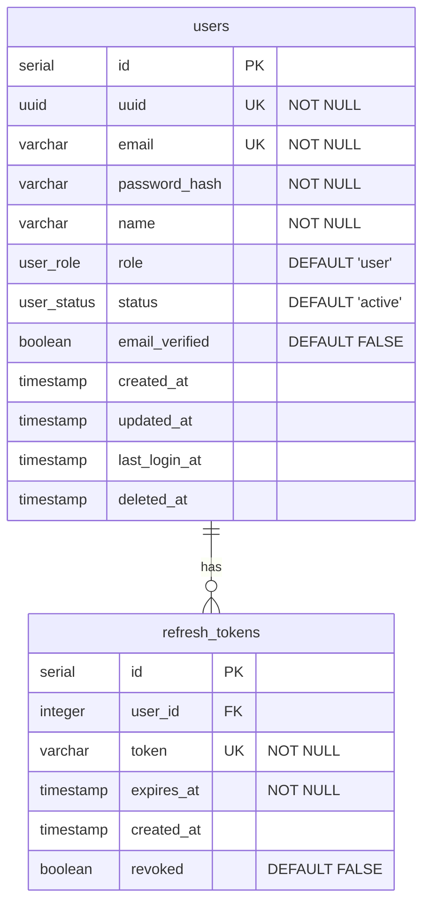

### 2.2 Recruitment Database

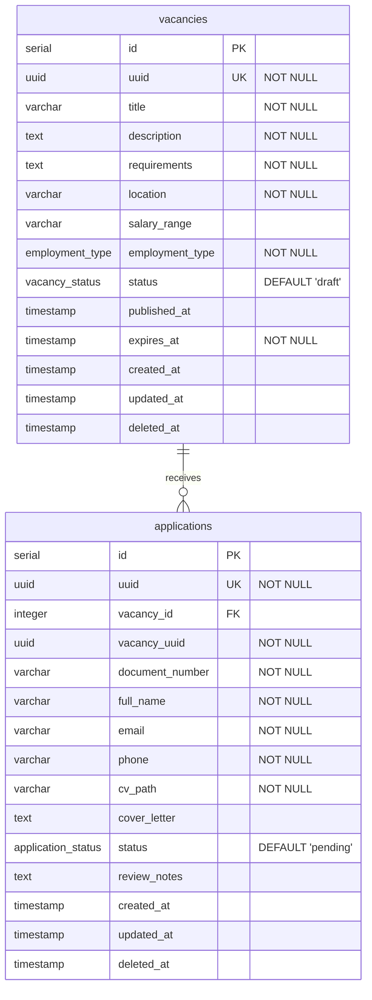

### 2.3 Document Database

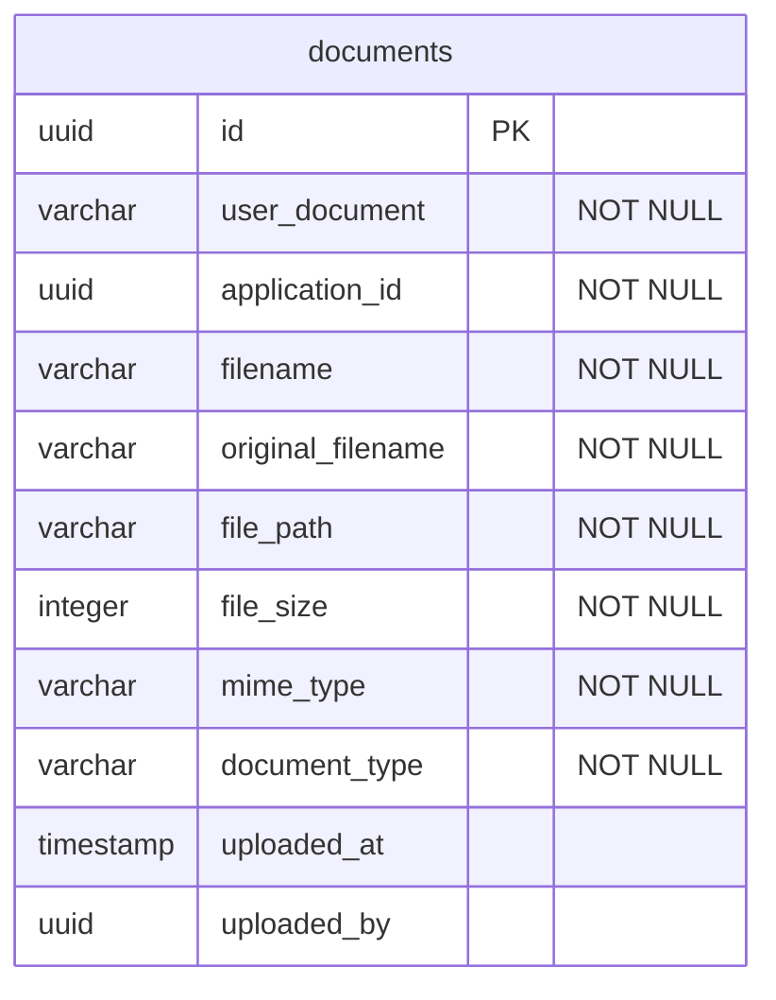

**Tipos ENUM:**
- **user_role**: 'admin', 'recruiter', 'user'
- **user_status**: 'active', 'inactive', 'suspended'
- **employment_type**: 'full-time', 'part-time', 'contract', 'internship'
- **vacancy_status**: 'draft', 'published', 'closed', 'filled'
- **application_status**: 'pending', 'reviewing', 'interviewed', 'accepted', 'rejected'
- **document_type**: 'cv', 'carta_presentacion', 'certificado', 'diploma', 'referencia', 'otro'

---

## 3. Diagrama de Casos de Uso

```mermaid
graph TB
    subgraph "Sistema PRISMA"
        subgraph "Gestión de Autenticación"
            UC1[Registrar Usuario]
            UC2[Iniciar Sesión]
            UC3[Cerrar Sesión]
            UC4[Refrescar Token]
        end
        
        subgraph "Gestión de Vacantes"
            UC5[Crear Vacante]
            UC6[Editar Vacante]
            UC7[Eliminar Vacante]
            UC8[Publicar Vacante]
            UC9[Listar Vacantes Activas]
            UC10[Ver Detalle de Vacante]
            UC11[Mejorar Texto con IA]
        end
        
        subgraph "Gestión de Postulaciones"
            UC12[Aplicar a Vacante]
            UC13[Subir CV]
            UC14[Consultar Estado de Postulación]
            UC15[Listar Postulaciones]
            UC16[Actualizar Estado de Postulación]
            UC17[Descargar CV]
            UC18[Eliminar Postulación]
        end
        
        subgraph "Gestión de Documentos"
            UC19[Subir Documento]
            UC20[Obtener URL de Documento]
            UC21[Listar Documentos por Usuario]
            UC22[Eliminar Documento]
        end
        
        subgraph "Gestión de Usuarios"
            UC23[Listar Usuarios]
            UC24[Cambiar Rol de Usuario]
            UC25[Ver Perfil]
            UC26[Actualizar Perfil]
        end
    end
    
    CAND[👤 Candidato<br/>Público]
    REC[👤 Reclutador]
    ADMIN[👤 Administrador]
    
    CAND --> UC2
    CAND --> UC9
    CAND --> UC10
    CAND --> UC12
    CAND --> UC13
    CAND --> UC14
    
    REC --> UC2
    REC --> UC5
    REC --> UC6
    REC --> UC8
    REC --> UC9
    REC --> UC10
    REC --> UC11
    REC --> UC15
    REC --> UC16
    REC --> UC17
    REC --> UC25
    
    ADMIN --> UC1
    ADMIN --> UC2
    ADMIN --> UC3
    ADMIN --> UC5
    ADMIN --> UC6
    ADMIN --> UC7
    ADMIN --> UC8
    ADMIN --> UC9
    ADMIN --> UC10
    ADMIN --> UC11
    ADMIN --> UC15
    ADMIN --> UC16
    ADMIN --> UC17
    ADMIN --> UC18
    ADMIN --> UC23
    ADMIN --> UC24
    ADMIN --> UC25
    ADMIN --> UC26
    
    style CAND fill:#90caf9,stroke:#333,stroke-width:2px
    style REC fill:#ffb74d,stroke:#333,stroke-width:2px
    style ADMIN fill:#e57373,stroke:#333,stroke-width:2px
```

---

## 4. Diagramas de Secuencia

### 4.1 Flujo de Autenticación (Login)

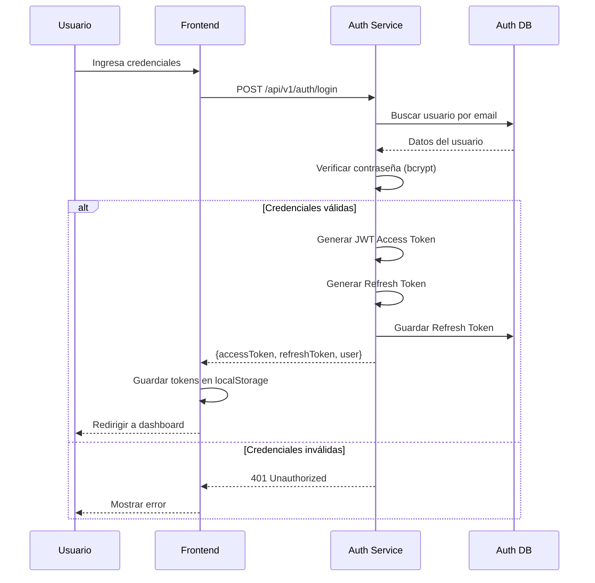

### 4.2 Flujo de Postulación a Vacante

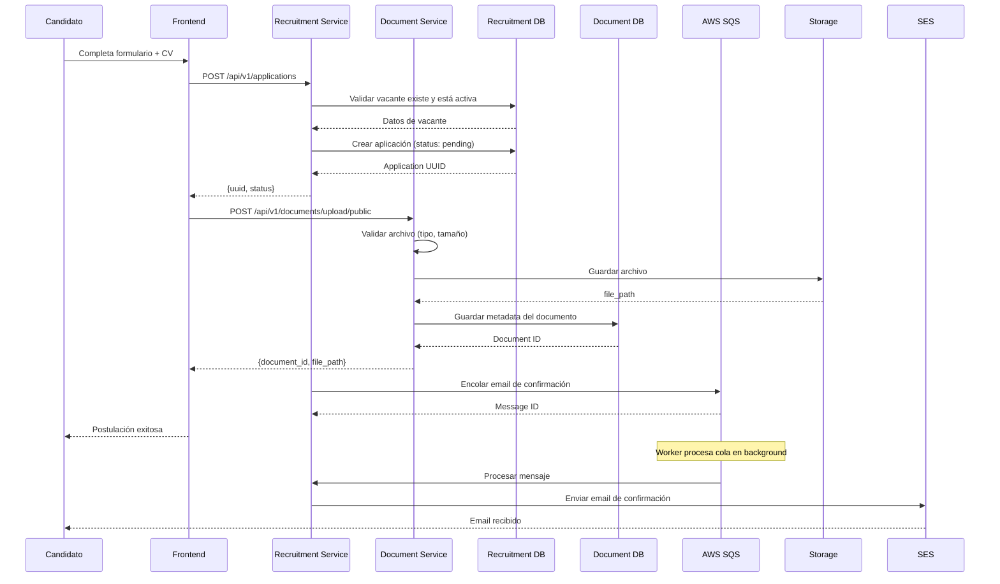

### 4.3 Flujo de Actualización de Estado de Postulación

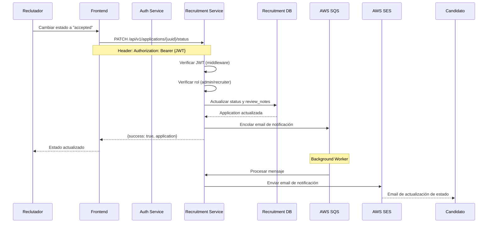

### 4.4 Flujo de Validación JWT entre Servicios

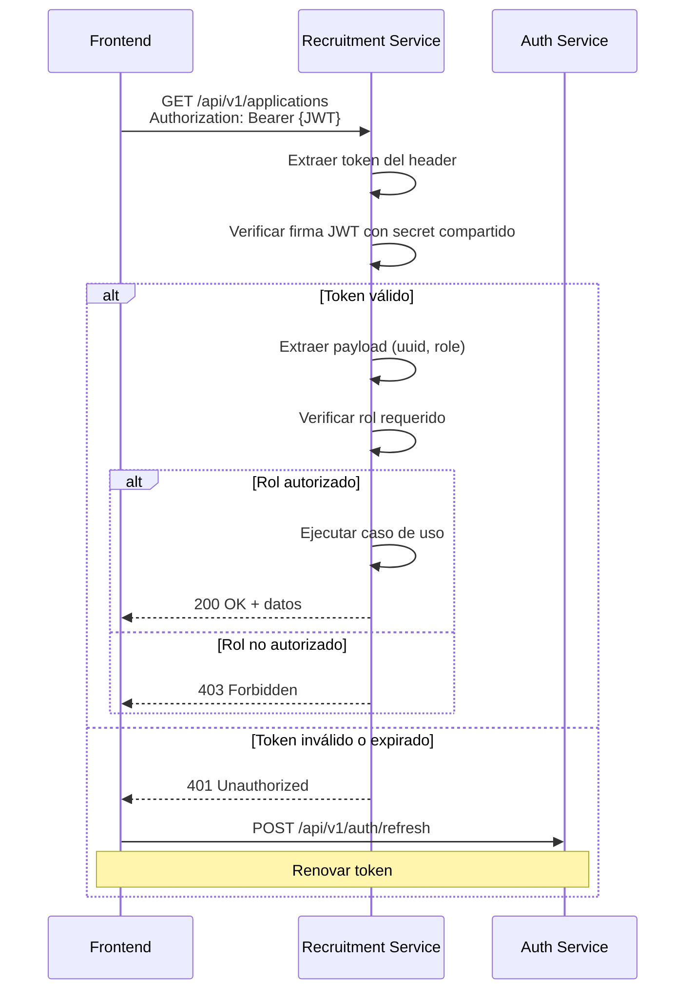

---

## 5. Diagrama de Componentes - Clean Architecture

### 5.1 Auth Service (TypeScript)

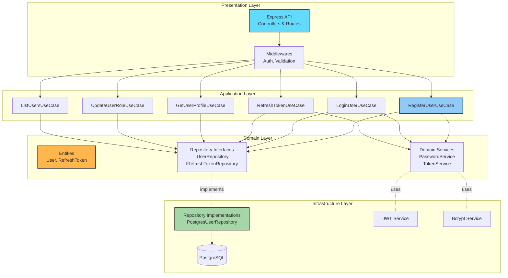

### 5.2 Recruitment Service (PHP)

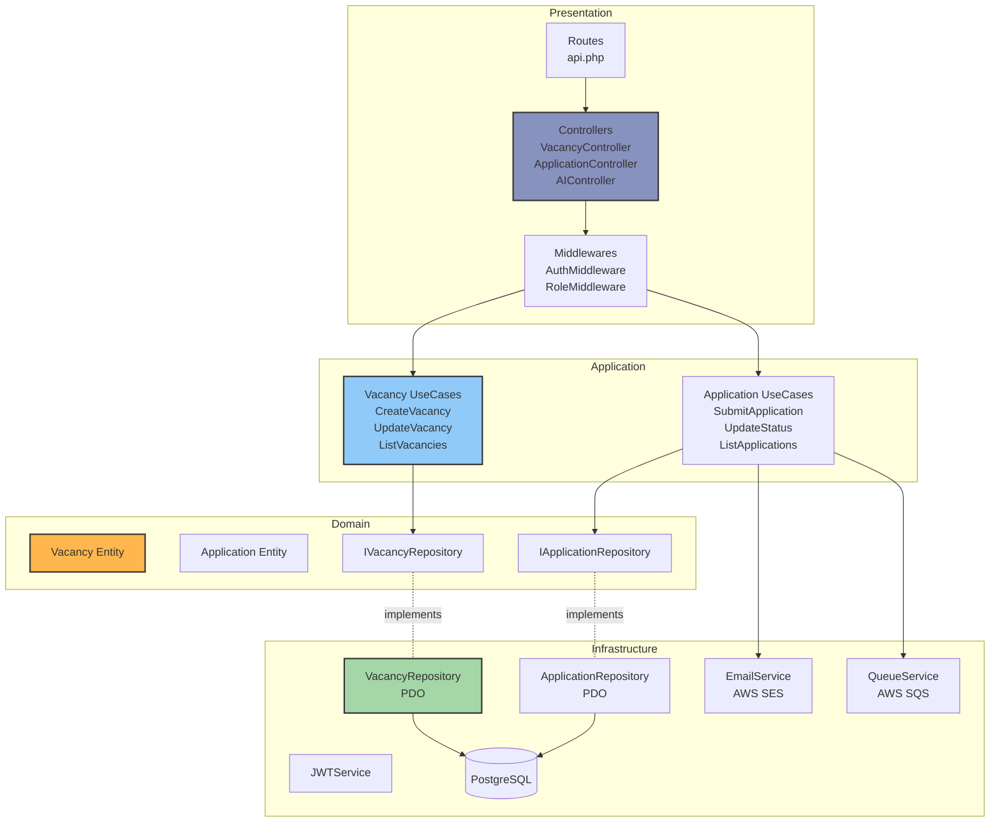

### 5.3 Document Service (Python)

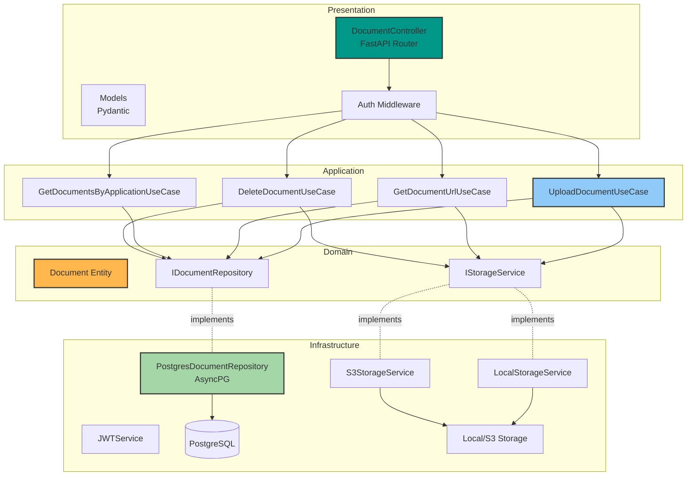

---

## 6. Diagrama de Despliegue

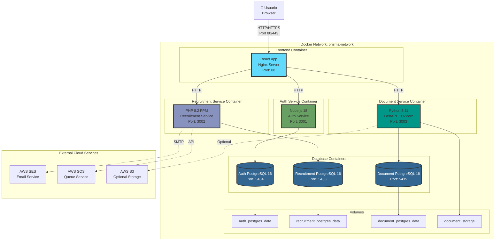

**Especificaciones de Despliegue:**

- **Orquestación**: Docker Compose
- **Red**: Bridge network compartida (prisma-network)
- **Persistencia**: Volumes de Docker para bases de datos y storage
- **Health Checks**: Configurados para todos los servicios
- **Environment Variables**: Configuradas mediante `.env` files
- **Restart Policy**: `unless-stopped` en producción

---

## 7. Diagrama de Clases del Dominio

### 7.1 Auth Service Domain

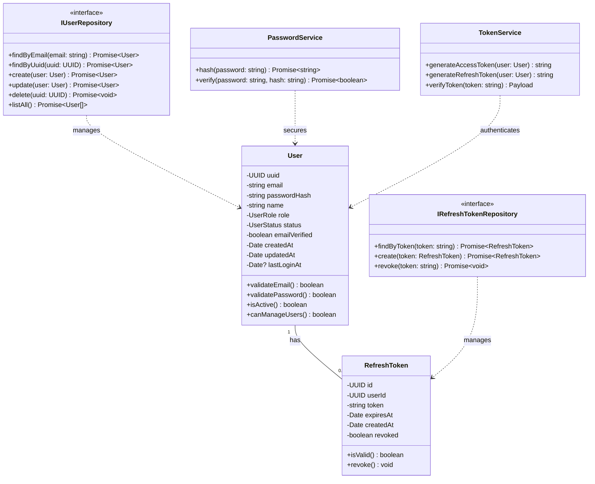

### 7.2 Recruitment Service Domain

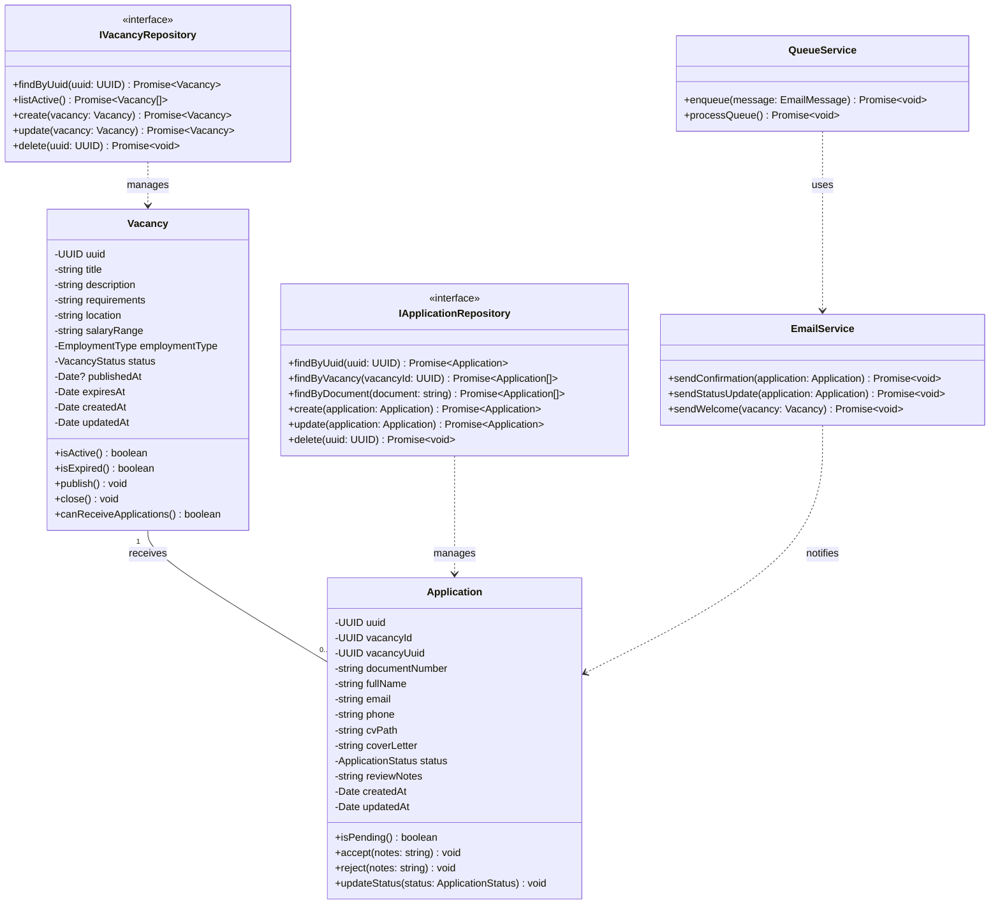

### 7.3 Document Service Domain

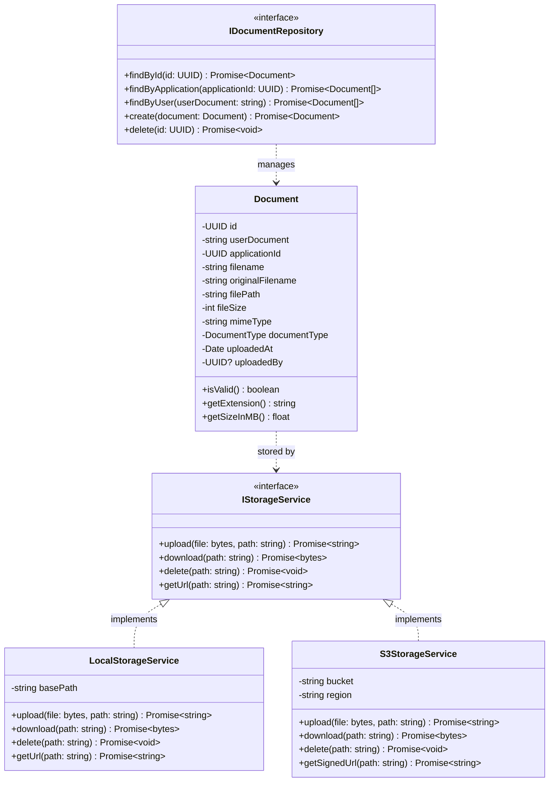

---

## 8. Patrones de Diseño Implementados

### 8.1 Arquitectura y Estructurales
- **Clean Architecture**: Separación de capas (Domain, Application, Infrastructure, Presentation)
- **Microservices Pattern**: Servicios independientes con bases de datos separadas
- **Repository Pattern**: Abstracción de acceso a datos
- **Dependency Injection**: Inyección de dependencias en constructores
- **DTO Pattern**: Data Transfer Objects para comunicación entre capas

### 8.2 Comportamentales
- **Use Case Pattern**: Casos de uso para lógica de aplicación
- **Strategy Pattern**: LocalStorageService vs S3StorageService
- **Observer Pattern**: Queue service para procesamiento asíncrono

### 8.3 Seguridad
- **JWT Authentication**: Token-based authentication
- **Role-Based Access Control (RBAC)**: admin, recruiter, user
- **Middleware Pattern**: Validación de autenticación y autorización

---

## 9. Tecnologías Utilizadas

| Capa | Auth Service | Recruitment Service | Document Service | Frontend |
|------|--------------|-------------------|------------------|----------|
| **Lenguaje** | TypeScript | PHP | Python | TypeScript |
| **Framework** | Express | Slim 4 | FastAPI | React + Vite |
| **Base de Datos** | PostgreSQL 16 | PostgreSQL 16 | PostgreSQL 16 | - |
| **ORM/Driver** | pg (node-postgres) | PDO | AsyncPG | - |
| **Autenticación** | JWT + Bcrypt | JWT Verification | JWT Verification | JWT Client |
| **Validación** | Joi | Built-in | Pydantic | Zod |
| **Contenedor** | Node 18 Alpine | PHP 8.2 FPM | Python 3.11 Slim | Nginx Alpine |
| **Comunicación** | REST | REST | REST | Axios HTTP |

---

## 10. Endpoints de API

### Auth Service (Port 3001)
```
POST   /api/v1/auth/register         - Registrar usuario
POST   /api/v1/auth/login            - Iniciar sesión
POST   /api/v1/auth/refresh          - Refrescar token
GET    /api/v1/auth/me               - Obtener perfil (autenticado)
POST   /api/v1/auth/logout           - Cerrar sesión (autenticado)
GET    /api/v1/users                 - Listar usuarios (admin)
GET    /api/v1/users/:uuid           - Obtener usuario (admin)
PATCH  /api/v1/users/:uuid/role      - Actualizar rol (admin)
```

### Recruitment Service (Port 3002)
```
GET    /api/v1/vacancies/active      - Listar vacantes activas (público)
GET    /api/v1/vacancies/all         - Listar todas (público)
GET    /api/v1/vacancies/:uuid       - Ver vacante (público)
POST   /api/v1/vacancies             - Crear vacante (admin/recruiter)
PUT    /api/v1/vacancies/:uuid       - Actualizar vacante (admin/recruiter)
DELETE /api/v1/vacancies/:uuid       - Eliminar vacante (admin)

POST   /api/v1/applications          - Enviar postulación (público)
GET    /api/v1/applications/status/:document - Consultar estado (público)
GET    /api/v1/applications          - Listar postulaciones (admin/recruiter)
PATCH  /api/v1/applications/:uuid/status - Actualizar estado (admin/recruiter)
DELETE /api/v1/applications/:uuid    - Eliminar postulación (admin)
POST   /api/v1/applications/bulk-delete - Eliminación masiva (admin)

POST   /api/v1/ai/improve-text       - Mejorar texto con IA (público)
```

### Document Service (Port 3003)
```
POST   /api/v1/documents/upload/public    - Subir documento (público)
POST   /api/v1/documents/upload           - Subir documento (autenticado)
GET    /api/v1/documents/:id/url          - Obtener URL (autenticado)
GET    /api/v1/documents/application/:id  - Listar por aplicación (autenticado)
GET    /api/v1/documents/user/:document   - Listar por usuario (autenticado)
DELETE /api/v1/documents/:id              - Eliminar documento (admin)
```

---

## 📝 Notas

- Todos los diagramas están en formato **Mermaid** y se pueden visualizar directamente en GitHub, VS Code o cualquier visor compatible
- Para generar imágenes PNG/SVG, puedes usar herramientas como [Mermaid Live Editor](https://mermaid.live/)
- Los diagramas se actualizan conforme evoluciona el proyecto
- Fecha de creación: 19 de Noviembre de 2025

---

**Proyecto PRISMA** - Sistema de Reclutamiento con Microservicios  
**Autor**: DIEGHOST64  
**Repositorio**: github.com/DIEGHOST64/Prisma
